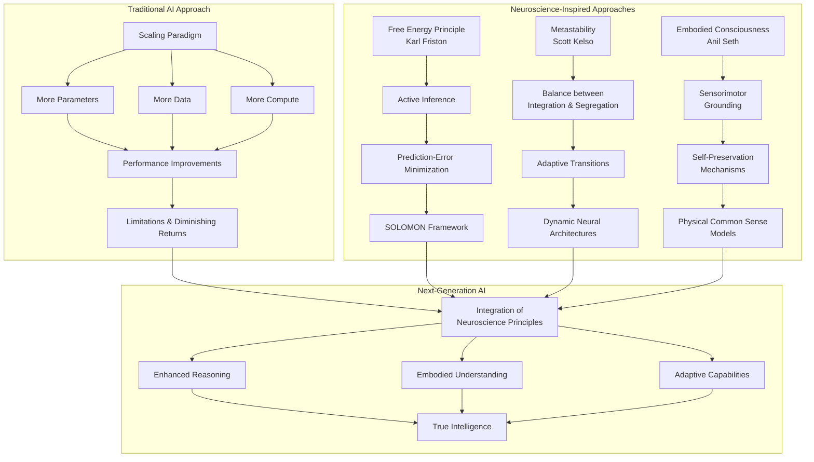

# Beyond Scaling: Why AI Needs Neuroscience for True Intelligence
*Research Summary - March 2025*

## Introduction: The Scaling Paradigm at a Crossroads

The artificial intelligence industry finds itself at a critical juncture in early 2025. The dominant paradigm of "scaling laws" - the predictable improvement of model performance through increased compute, data, and parameters - is showing signs of diminishing returns. As reported by TechCrunch in March 2025, researchers are exploring alternative methods of scaling AI beyond the traditional approaches, with many experts expressing skepticism about whether conventional scaling alone can deliver true artificial general intelligence (AGI).

The limitations of the current scaling approach have become increasingly apparent. According to tech industry analysis published in early 2025, major AI companies are experiencing significant delays in next-generation model releases, with xAI's Grok 3 missing its planned release date and similar postponements from other industry leaders. These setbacks have prompted fundamental questions about whether we've reached natural limits in the current scaling paradigm.

The AI research community is now looking beyond traditional scaling to neuroscience-inspired approaches, recognizing that human-like intelligence emerges from principles fundamentally different from statistical pattern matching. Three neuroscientific frameworks offer particular promise: Karl Friston's Free Energy Principle, Scott Kelso's concept of metastability, and Anil Seth's theories of embodied consciousness. This document explores how these frameworks are being integrated into cutting-edge AI research in 2025.

## Core Frameworks: Neuroscience Principles Redefining AI

### The Free Energy Principle and Active Inference

Karl Friston's Free Energy Principle (FEP) has emerged as a foundational framework for next-generation AI systems. In a 2025 interview published by Singularity University, Friston emphasized that the current trajectory of machine learning - focused on increasing parameters and data - represents "exactly the wrong direction from the point of view of the physicist." Instead, Friston argues for focusing on "smart data" and the "sparse data that you need in order to resolve your uncertainty."

The FEP describes the brain as an adaptive system continually minimizing uncertainty through active inference - a cycle of predicting sensory inputs and updating beliefs when predictions don't match reality. Unlike passive pattern recognition in current AI, this involves actively engaging with the environment through an action-perception loop. Recent research published in early 2025 demonstrates how this principle is being applied to next-generation AI systems:

- IBM and MIT researchers introduced SOLOMON in February 2025, a neuro-inspired reasoning network incorporating the Free Energy Principle. This architecture optimizes reasoning by reducing discrepancies between expected and observed outcomes, particularly for semiconductor layout design tasks. Rather than requiring continuous retraining like traditional models, SOLOMON adapts dynamically through its three-component system (Thought Generators, Thought Assessors, and a Steering Subsystem).

- A January 2025 paper titled "Boosting MCTS with Free Energy Minimization" demonstrates how Active Inference principles can be applied to Monte Carlo Tree Search algorithms to create more adaptive and efficient decision-making in complex environments.

### Metastability: Beyond Critical States to Adaptive Dynamics

Scott Kelso's work on metastability represents another crucial framework for advancing AI beyond traditional scaling. Unlike the critical brain hypothesis, which suggests the brain operates at a critical point between chaos and order, Kelso's research indicates that the brain maintains a metastable state - allowing it to flexibly transition between integration (coordination between brain areas) and segregation (specialized processing in discrete regions).

Recent work expanding on Kelso's research, published in early 2025, demonstrates how metastability can provide essential capabilities missing from current AI systems:

- A comprehensive review titled "Metastability demystified" (early 2025) traces the evolution of metastability concepts from theoretical foundations to practical applications in neural networks, highlighting how metastable dynamics enable adaptive information processing.

- Ongoing research at Florida Atlantic University's Human Brain and Behavior Laboratory is applying Kelso's principles to develop AI systems with more human-like adaptive capabilities, focusing on the intermediate-sized ensembles that bridge micro and macro scales of coordination.

### Embodied Consciousness and AI Development

Anil Seth's work on embodied consciousness provides the third critical framework for advancing AI beyond scaling. In his 2024 paper "Conscious artificial intelligence and biological naturalism," Seth argues that consciousness emerges from being a living, embodied self-organized organism fundamentally motivated by self-preservation - not merely from algorithmic complexity.

Seth's research challenges the assumption that consciousness will spontaneously emerge from scaling up computational models. Rather, his work suggests that meaningful intelligence requires grounding in sensorimotor experience and biological imperatives:

- The University of Sussex AI Research Group continues to explore consciousness from a computational neuroscience perspective, investigating how conscious experience might emerge from predictive processing frameworks.

- Seth's early 2025 research emphasizes that AI systems capable of genuine understanding must incorporate elements of embodiment and active engagement with their environment, rather than passive processing of abstract data.

## The Integration Paradigm: Combining Neuroscience with AI

The most promising developments in AI research for 2025 involve integrating these neuroscience principles into practical applications:

### Neuro-Inspired Reasoning Networks

The SOLOMON framework from IBM and MIT represents one of the most significant advances in neuroscience-inspired AI in early 2025. By incorporating the Free Energy Principle into its architecture, SOLOMON demonstrates several advantages over traditional large language models:

- The ability to correct logical inconsistencies and arithmetic errors through continuous refinement and assessment
- Enhanced spatial reasoning capabilities, particularly for complex design tasks
- Reduced hallucination issues compared to traditional LLMs
- Improved adaptability to domain-specific problems without requiring continuous retraining

This represents a fundamental shift from simply scaling up existing models to developing architecturally different systems guided by neuroscientific principles.

### Embodied AI Systems

Advances in embodied AI systems show increasing integration of principles from Seth's work on consciousness and embodiment:

- NVIDIA's Cosmos-Reason1 (March 2025) represents a breakthrough in multimodal models for physical common sense and embodied reasoning, incorporating principles that align with Seth's theories of how conscious understanding emerges.

- Research on embodied AI is increasingly focused on giving systems the ability to learn through interaction with their environment, rather than passive ingestion of training data.

### Metastable Computational Architectures

Applications of Kelso's metastability principles are beginning to influence AI architectural design:

- New neural network architectures inspired by metastability concepts are demonstrating improved adaptability to changing conditions without catastrophic forgetting.

- Research published in early 2025 demonstrates how metastable dynamics enable more flexible transitions between different processing regimes, allowing AI systems to balance specialization with integration.

## Conclusion: A New Paradigm Emerges

The integration of neuroscience principles into AI development represents a fundamental shift from the simple scaling paradigm that has dominated the field. While scaling laws have driven remarkable progress in AI capabilities, the research highlighted in this document suggests we are approaching the limits of what can be achieved through scaling alone.

The future of AI development increasingly points toward systems that incorporate principles from neuroscience - particularly the Free Energy Principle, metastability, and embodied cognition. These approaches promise AI systems that are not merely larger but fundamentally different in architecture and function, capable of more human-like understanding, creativity, and adaptability.

As the AI industry confronts the limitations of traditional scaling, these neuroscience-inspired approaches offer a promising alternative path toward more capable and genuinely intelligent systems. The most significant advances in 2025 and beyond will likely come not from incrementally larger models, but from new architectures that draw inspiration from how intelligence emerges in biological systems.

## References

1. TechCrunch. (2025, March 19). Researchers say they've discovered a new method of 'scaling up' AI, but there's reason to be skeptical. https://techcrunch.com/2025/03/19/researchers-say-theyve-discovered-a-new-method-of-scaling-up-ai-but-theres-reason-to-be-skeptical/

2. OpenTools.AI. (2025, January). AI Industry Faces Major Setbacks: Are Scaling Laws Reaching Their Limits? https://opentools.ai/news/ai-industry-faces-major-setbacks-are-scaling-laws-reaching-their-limits

3. Friston, K. (2025). How Free Energy Shapes the Future of AI. Singularity University. https://www.su.org/resources/how-free-energy-shapes-the-future-of-ai

4. IBM & MIT Research Team. (2025, February). SOLOMON: A Neuro-Inspired Reasoning Network for Enhancing LLM Adaptability in Semiconductor Layout Design. https://www.marktechpost.com/2025/02/16/this-ai-paper-from-ibm-and-mit-introduces-solomon-a-neuro-inspired-reasoning-network-for-enhancing-llm-adaptability-in-semiconductor-layout-design/

5. Seth, A.K. (2024). Conscious artificial intelligence and biological naturalism. PsyArXiv. https://www.anilseth.com/research/key-papers/

6. Kelso, J.A.S. (2025). The Metastable Brain~Mind. arXiv Preprint. https://arxiv.org/abs/2303.04146

7. NVIDIA Research. (2025, March). Cosmos-Reason1: A Multimodal Model for Physical Common Sense and Embodied Reasoning. https://www.marktechpost.com/2025/03/24/this-ai-paper-from-nvidia-introduces-cosmos-reason1-a-multimodal-model-for-physical-common-sense-and-embodied-reasoning/

8. University of Sussex AI Research Group. (2025). Consciousness Research. https://www.sussex.ac.uk/research/centres/ai-research-group/research/consciousness

9. Hardy-White, D. (2025, January). Are AI Scaling Laws Hitting a Wall? https://deanhardywhite.substack.com/p/are-ai-scaling-laws-hitting-a-wall

10. Riken Research Institute & VERSES. (2025). Revolutionary AI Whitepaper Validated by New Neuroscience Breakthrough. https://deniseholt.us/revolutionary-ai-whitepaper-validated-by-new-neuroscience-breakthrough/

## Conceptual Framework: Mermaid Flowchart

